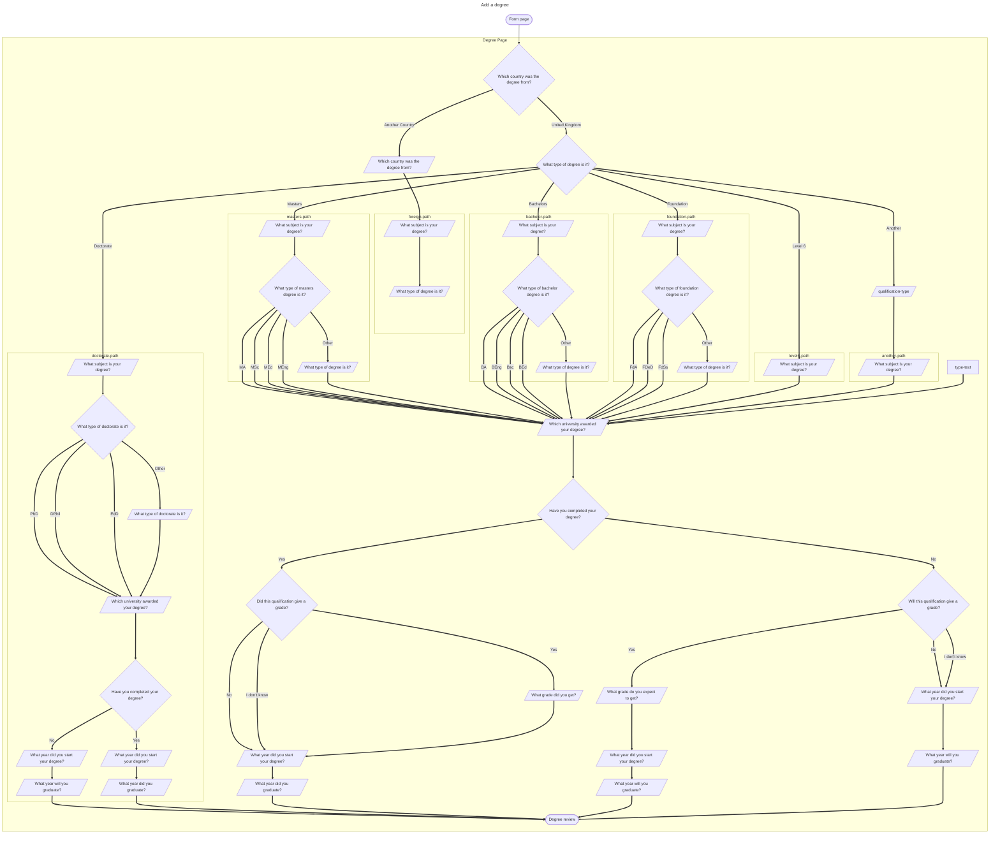

# Degrees Flow

## Flowchart

## Paths

| Title    | Path    |
|---------------- | --------------- |
| Degree   | `candidate/application/degrees/review`   |
| What country was the degree from?    | `candidate/application/degrees/country`    |
| What type of degree is it?    | `candidate/application/degrees/level`    |
| What subject is your degree?   | `candidate/application/degrees/subject`   |
| What type of TYPE degree is it?   | `candidate/application/degrees/types`   |
| Which university awarded your degree?   | `candidate/application/degrees/university`   |
| Have you completed your degree?   | `candidate/application/degrees/completed`   |
| Did this qualification give a grade?   | `candidate/application/degrees/grade`   |
| What year did you start your degree?   | `candidate/application/degrees/start-year`   |
| What year did you graduate?   | `candidate/application/degrees/graduation-year`   |

