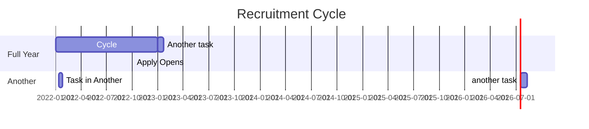

# Time Travel

The teacher training system is entirely based around time, deadlines and schedules.

Courses have a start and end date. Enrolment must be complete by a certain time before courses begin. This happens every year. Applications can be carried over from one year to another.

This can get quite complicated and needs to be modelled and tested thorougly.

A cycle runs from apply opens in one year to apply opens in the next year. Each cycle has milestones, when something fundamental about the cycle changes. We call these CycleEvents. The bits in between cycle events are called CycleStage.

### Terminology

|Term|Meaning|
|---|---|
|RecruitmentCycle| Date from when "find" opens in one year until when find reopens this is   normally October to October |
|CycleStage|When a portion of the cycle where a particular set of abilities is available to the candidate|
|CycleEvent|Point of the cycle where the cycle transitions from one stage to the next |

### 2023 Recruitment Cycle

## Recruitment Cycles

A course will start in September and end in June.
Applications are open from October the previous year.

## CycleSwitcher
The cycle switcher allows support users to manipulate time in test environments. This is done for testing purposes so we can run the application in various stages of the cycle.

## TestSuite
